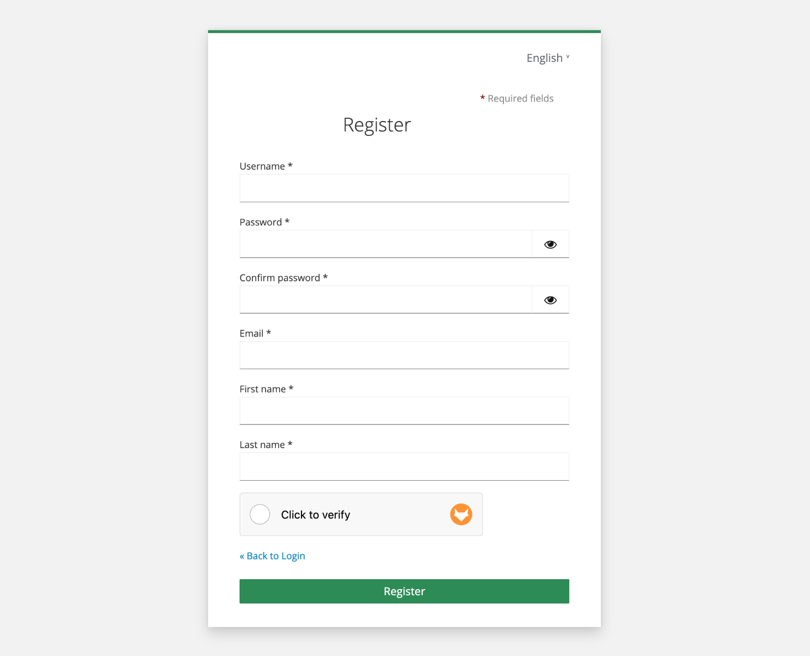

# CaptchaFox for Keycloak

This plugin adds support for the privacy-friendly bot protection provider CaptchaFox to Keycloak.



## Getting started

Visit our [documentation](https://docs.captchafox.com/integrations/keycloak) for a step-by-step guide on how to install and configure this plugin for your Keycloak instance.

## Development

Compile it using Maven with Java 17:

```bash
mvn clean compile package
```

or execute the `build.sh` script.

Then copy the `keycloak-captchafox.jar` from the `target` directory to the `providers` folder in keycloak.

## Credits

Thanks to keycloak and p08dev for the original recaptcha implementation on which this is based on.
